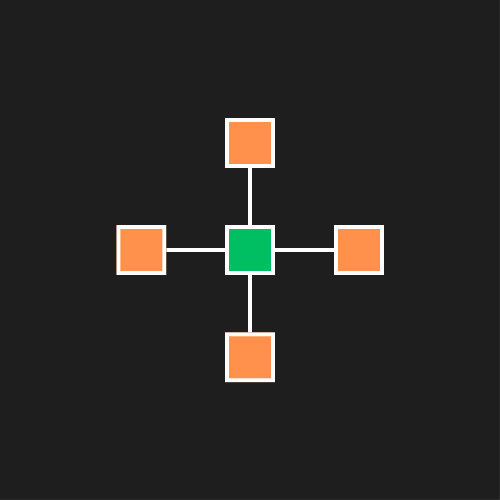

#majôrlang - Hardware-Oriented Programming Language

**majôrlang** é uma linguagem de programação orientada a hardware projetada para fornecer controle direto e preciso sobre dispositivos e componentes físicos. Ela foi criada com o objetivo de oferecer aos desenvolvedores ferramentas de baixo nível que permitem uma interação eficiente com o hardware, utilizando recursos mínimos e garantindo desempenho otimizado.

## Objetivo

O foco principal da **majôrlang** é habilitar programadores a interagir diretamente com o hardware de forma simples, precisa e eficiente. Diferente de linguagens de alto nível, que abstraem grande parte do hardware subjacente, nossa linguagem proporciona um nível de controle granular, essencial para aplicações embarcadas e de IoT, onde o baixo consumo de energia e o controle direto são fundamentais.

## Características

- Controle direto de hardware: Permite acesso a registradores, portas de I/O e comunicação com dispositivos externos sem a complexidade das abstrações de alto nível.

- Desempenho otimizado: Projetada para funcionar com baixo overhead, oferecendo um desempenho superior em dispositivos embarcados e sistemas de tempo real.

- Compilação multiplataforma: Construída sobre C++, utilizando compiladores já estabelecidos, o que garante portabilidade para diversas arquiteturas.

- Foco em eficiência energética: Inclui funcionalidades que auxiliam na gestão de recursos, crucial para sistemas que exigem baixo consumo de energia.

- Sintaxe moderna: Uma estrutura clara e intuitiva, que suporta loops, variáveis, condicionais e outras funcionalidades de controle de fluxo necessárias para um desenvolvimento eficiente.

### O Caminho do Desenvolvimento

Durante o desenvolvimento da **majôrlang**, houve momentos em que o propósito original quase foi alterado. Contudo, ao refletir sobre o objetivo principal, voltamos à essência do projeto: criar uma linguagem orientada ao controle de hardware, sem perder a simplicidade e o foco em baixo nível.

## Próximos Passos

Estamos trabalhando para incluir:

- Integração com APIs de hardware específicas para diversas plataformas.

- Funções otimizadas para manipulação de componentes como sensores, atuadores, e dispositivos conectados.

-  Melhorias na compilação e otimização de código gerado para diferentes arquiteturas de hardware.
